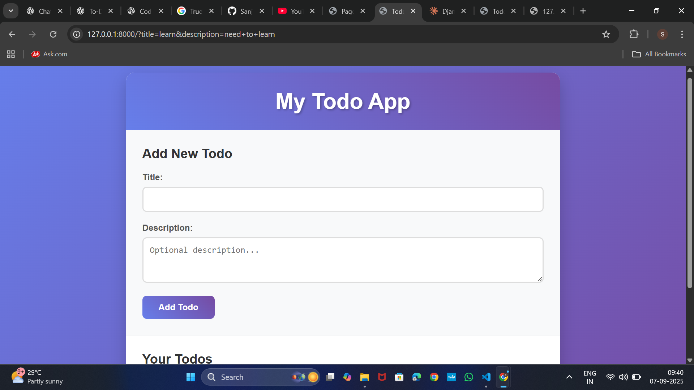

# Todo App

A simple and stylish Todo application built with Django (backend) and vanilla JavaScript (frontend). Todos are stored in a JSON file for easy management and persistence.



## Features

- Add, view, complete, and delete todos
- Responsive and modern UI
- Data stored in a JSON file (`todos.json`)
- RESTful API endpoints for todos
- CSRF protection for form submissions

## Project Structure

```
todoapp/
├── db.sqlite3
├── manage.py
├── todos.json
├── todosamle.png
├── static/
│   ├── css/
│   │   └── style.css
│   └── js/
│       └── main.js
├── todo/
│   ├── __init__.py
│   ├── admin.py
│   ├── apps.py
│   ├── Json_handler.py
│   ├── models.py
│   ├── tests.py
│   ├── urls.py
│   ├── views.py
│   ├── migrations/
│   └── templates/
│       └── todo/
│           └── index.html
└── todoapp/
    ├── __init__.py
    ├── asgi.py
    ├── settings.py
    ├── urls.py
    └── wsgi.py
```

## Getting Started

1. **Clone the repository:**
    ```sh
    git clone <your-repo-url>
    cd todoapp
    ```

2. **Install dependencies:**
    ```sh
    pip install -r requirements.txt
    ```

3. **Run migrations:**
    ```sh
    python manage.py migrate
    ```

4. **Start the development server:**
    ```sh
    python manage.py runserver
    ```

5. **Open your browser and visit:**
    ```
    http://127.0.0.1:8000/
    ```

## API Endpoints

- `GET /api/todos/` — List all todos
- `POST /api/todos/` — Add a new todo
- `PUT /api/todos/<id>/` — Update a todo (mark complete/incomplete)
- `DELETE /api/todos/<id>/` — Delete a todo

## License

This project is licensed under the MIT License.